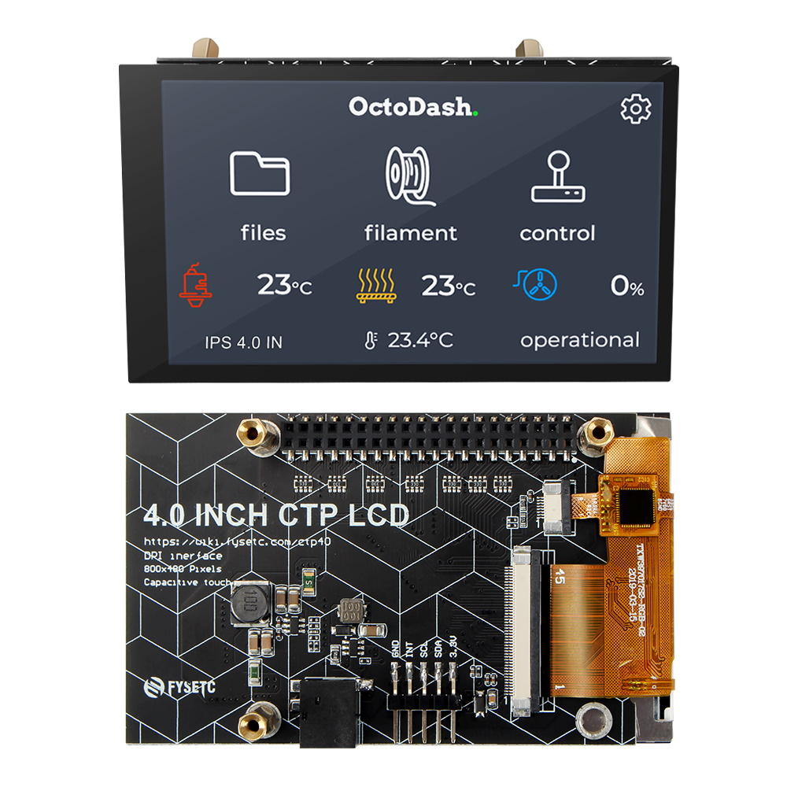
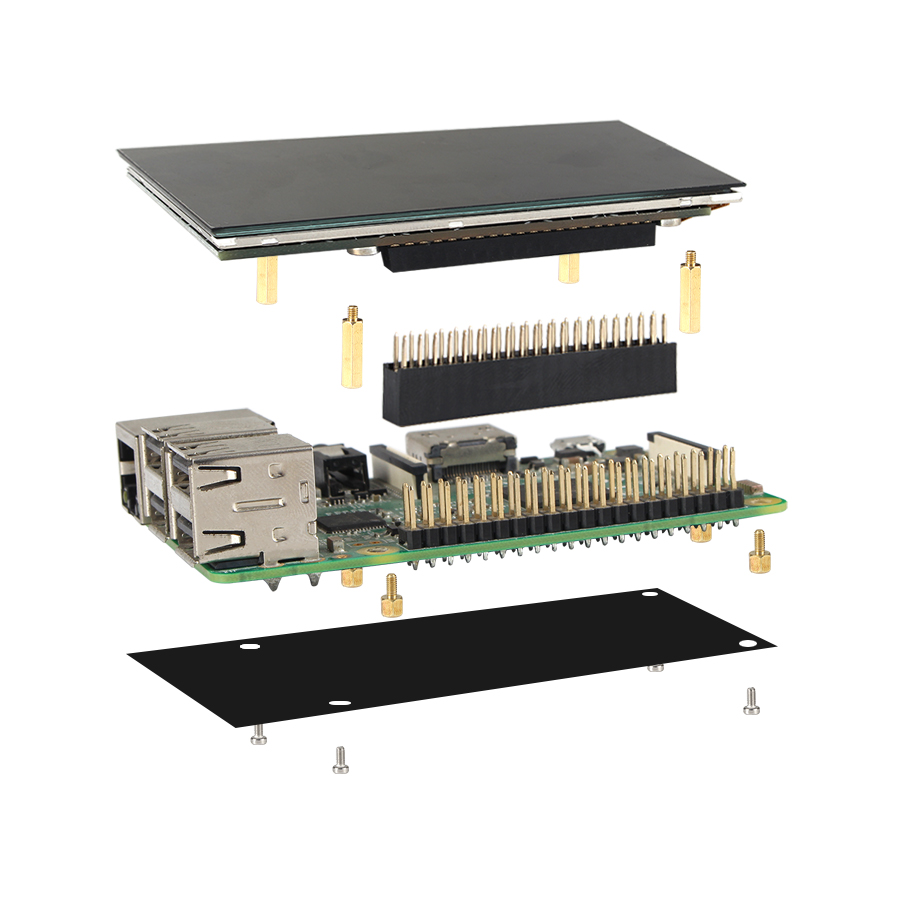
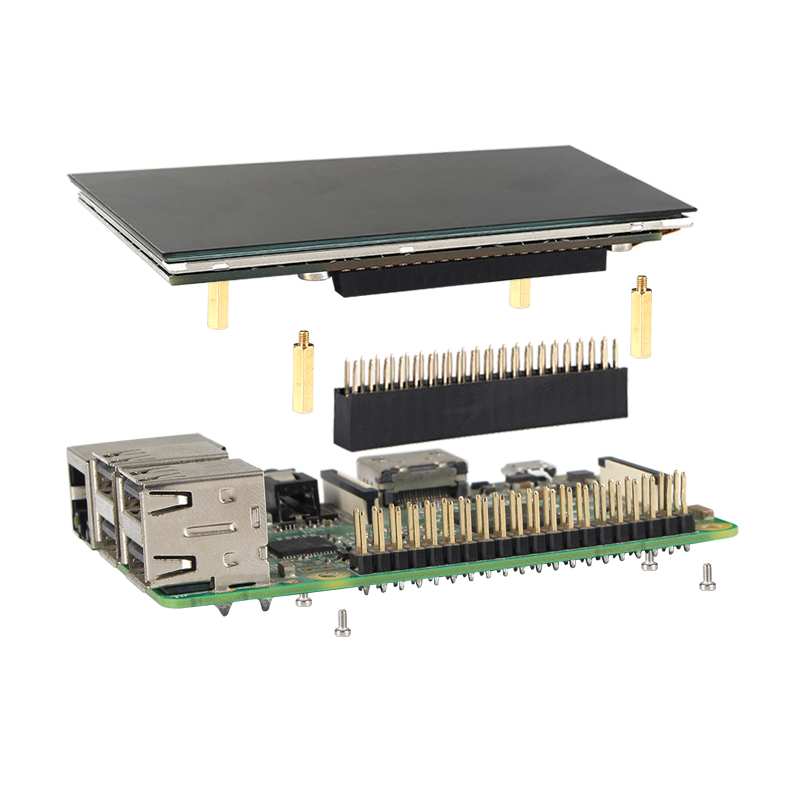

# 4 INCH CTP LCD Drivers

------



4 INCH CTP LCD(CTP40) is an 800x480 pixel display for the Raspberry Pi, with optional capacitive touchscreen.

## Features

- Size: 89.8mm x 58mm, the holes are fully compatible with Raspberry Pi .
- High-speed DPI interface
- 5V@3A DC-DC onboard(9-28V input)
- 4.0“ IPS (wide viewing angle, 160°) display (86.4x51.8mm)
- 800x480 pixels (~235 PPI)
- 18-bit colour (262,144 colours)
- 60 FPS frame rate
- Contrast ratio: 500:1
- Capacitive touch
- 40-pin female header included
- Standoffs included
- Compatible with all 40-pin header Raspberry Pi models
- Easy to install

## Dimensions


## Schematic diagram


You can download it on our [Github](https://www.aliexpress.com/item/1005001704413148.html)

## Install

If your Raspberry Pi needs to be fixed on the panel:

If your Raspberry Pi is not fixed:


## Driver install

Clone this repo first, run 

```
git clone https://github.com/FYSETC/FYSETC-CTP40
```

There are three folder name `Pi3` and `Pi4` and `Pi4-64-beta`, If you are using  Raspberry Pi3 and older device, please follow the README file in `Pi3` folder. And if you are using Raspberry Pi4 32bit OS, then follow the README file in `Pi4` folder. And if you are using Raspberry Pi4 64bit OS, then follow the README file in `Pi4-64-beta` folder.

if you run bullseye system and you get blank screen, better to comment out as below. Don't have a better solution now, i will keep looking into it.

```
#dtoverlay=vc4-kms-v3d
```

## How to change backlight

### 1. Install pigpio

First we need to install pigpio library, you can follow the instruction [here](http://abyz.me.uk/rpi/pigpio/download.html).

```
wget https://github.com/joan2937/pigpio/archive/master.zip
unzip master.zip
cd pigpio-master
make
sudo make install
```

If the Python part of the install fails it may be because you need the setup tools.

```
sudo apt install python-setuptools python3-setuptools
```

### 2. Copy `backlight.py` to your pi

There is `backlight.py` file in the repo, copy it to`/home/pi` path

### 3. Enable `backlight.service`

Copy the `backlight.service` file in this repo to `/etc/systemd/system`

```pigpiod
sudo cp backlight.service /etc/sysetmd/system/backlight.service
```

inform `systemd` that a new service has been added. This is done with the following command:

```
sudo systemctl daemon-reload
```

Now you can attempt to start the service using the following command:

```
sudo systemctl start backlight.service
```

Enable it to run at boot

```
sudo systemctl enable backlight.service
```

### 4. Change backlight value

```
nano /pi/home/backlight.py
```

change `128` to the value you want.

### 5. Reboot

```
sudo reboot
```

## Shop

[FYSETC-4INCH CTP LCD](https://www.aliexpress.com/item/1005002011585873.html?spm)

## Tech Support

Please submit any technical issue into our [github](https://github.com/FYSETC/FYSETC-CTP40) or [forum](http://forum.fysetc.com/) 